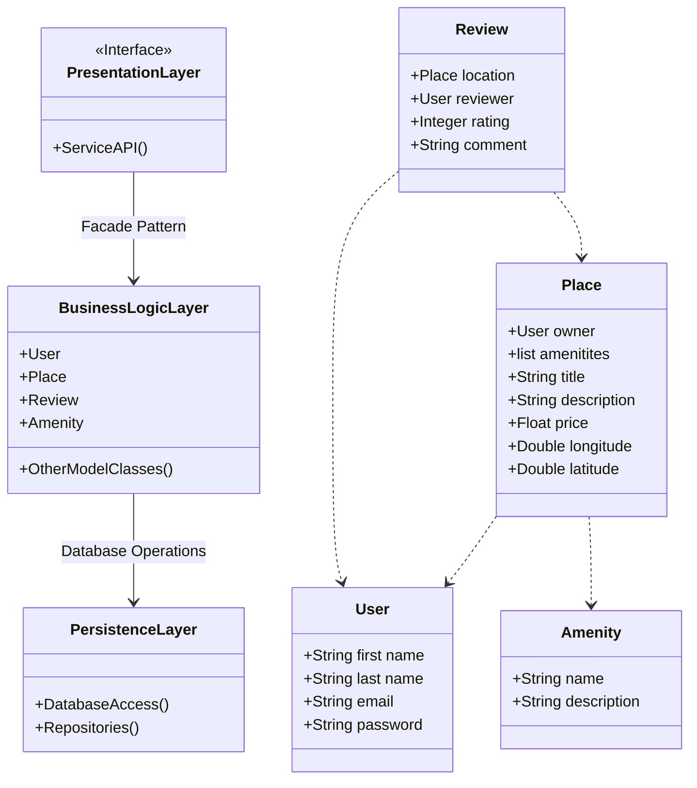

```mermaid
%% High-Level Package Diagram for HBnB Application
classDiagram
%% Presentation Layer
class PresentationLayer {
    <<Interface>>
    +ServiceAPI()
}

%% Business Logic Layer
class BusinessLogicLayer {
    +User
    +Place
    +Review
    +Amenity
    +OtherModelClasses()
}

%% Persistence Layer
class PersistenceLayer {
    +DatabaseAccess()
    +Repositories()
}

%% Communication via Facade Pattern
PresentationLayer --> BusinessLogicLayer : Facade Pattern
BusinessLogicLayer --> PersistenceLayer : Database Operations

class User {
  +String first name
  +String last name
  +String email
  +String password 
}

class Place {
  +User owner
  +list amenitites
  +String title
  +String description
  +Float price
  +Double longitude
  +Double latitude
}
Place ..> User
Place ..> Amenity

class Review {
  +Place location
  +User reviewer
  +Integer rating
  +String comment
}
Review ..> Place
Review ..> User

class Amenity {
  +String name
  +String description
}
```
