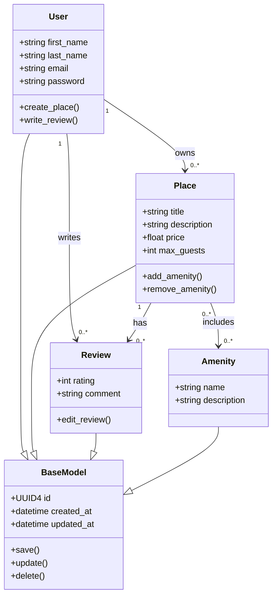

```mermaid
classDiagram

class BaseModel {
    +UUID4 id
    +datetime created_at
    +datetime updated_at
    +save()
    +update()
    +delete()
}

class User {
    +string first_name
    +string last_name
    +string email
    +string password
    +create_place()
    +write_review()
}

class Place {
    +string title
    +string description
    +float price
    +int max_guests
    +add_amenity()
    +remove_amenity()
}

class Review {
    +int rating
    +string comment
    +edit_review()
}

class Amenity {
    +string name
    +string description
}

User --|> BaseModel
Place --|> BaseModel
Review --|> BaseModel
Amenity --|> BaseModel

User "1" --> "0..*" Place : owns
User "1" --> "0..*" Review : writes
Place "1" --> "0..*" Review : has
Place "0..*" --> "0..*" Amenity : includes
```
