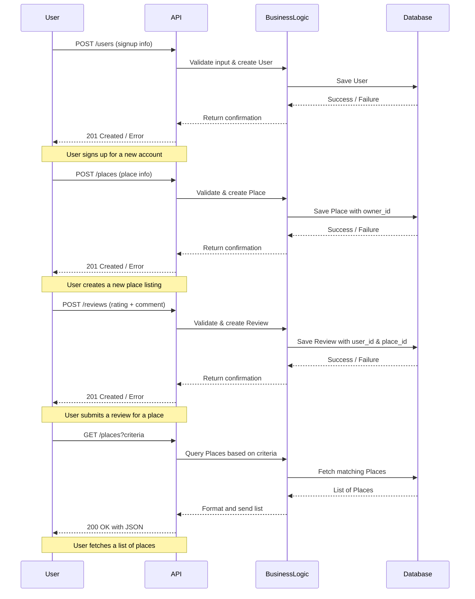

```mermaid
sequenceDiagram

participant User
participant API
participant BusinessLogic
participant Database

User->>API: POST /users (signup info)
API->>BusinessLogic: Validate input & create User
BusinessLogic->>Database: Save User
Database-->>BusinessLogic: Success / Failure
BusinessLogic-->>API: Return confirmation
API-->>User: 201 Created / Error
Note over User, API: User signs up for a new account


User->>API: POST /places (place info)
API->>BusinessLogic: Validate & create Place
BusinessLogic->>Database: Save Place with owner_id
Database-->>BusinessLogic: Success / Failure
BusinessLogic-->>API: Return confirmation
API-->>User: 201 Created / Error
Note over User, API: User creates a new place listing


User->>API: POST /reviews (rating + comment)
API->>BusinessLogic: Validate & create Review
BusinessLogic->>Database: Save Review with user_id & place_id
Database-->>BusinessLogic: Success / Failure
BusinessLogic-->>API: Return confirmation
API-->>User: 201 Created / Error
Note over User, API: User submits a review for a place

User->>API: GET /places?criteria
API->>BusinessLogic: Query Places based on criteria
BusinessLogic->>Database: Fetch matching Places
Database-->>BusinessLogic: List of Places
BusinessLogic-->>API: Format and send list
API-->>User: 200 OK with JSON
Note over User, API: User fetches a list of places
```
